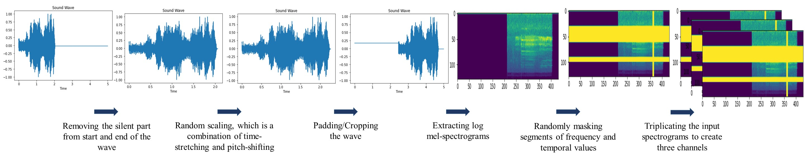

# Contrastive-Learning-in-ESC
<h3> Three Training Schemes For The Audio Classifiers: </h3>


<p align="center"></p>

<h3> Data Augmentation: </h3>


### Setup and Dependencies:
First, install the above dependencies.

Second, download ESC50 and US8K datasets and put them inside the 'data' directory, and assign True to the dataset that you want to use to train your model, in config.py

###Quickstart
#### Training with Cross-Entropy Loss
 To train a classifier with ResNet-50 with cross-entropy loss:
```
$ python train_crossEntropyLoss.py
```
#### Training with Supervised-Contrastive Loss
Stage 1:
To train a classifier with ResNet-50 with supervised-contrastive loss: 
```
$ python train_contrastiveLoss.py
```
Stage2:
and then update path_to_classifierModel in config.py with the path to the ResNet model trained in stage1, and:
```
$ python train_classifier.py
```
#### Training with Hybrid Loss
To train a classifier with ResNet-50 with hybrid loss:
```
$ python train_hybridLoss.py
```

### Configuration Options
By modifying config.py file <br>
You can change the training hyperparameters, the alpha value for the hybrid loss, and maximul-length and number of the masking segments for the data augmentation.
